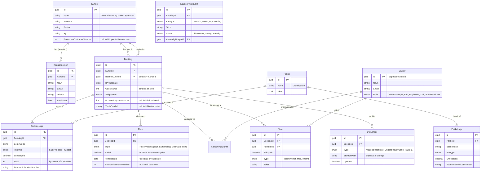
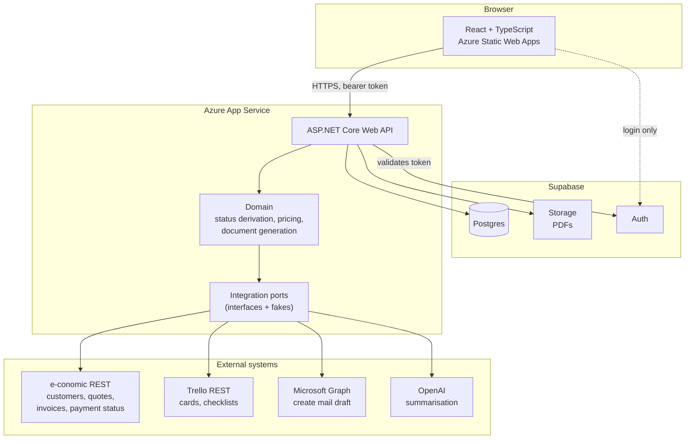
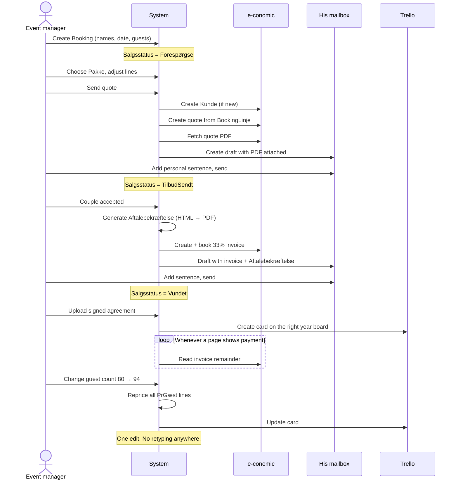

# Architecture and data model

Companion to [CONTEXT.md](./CONTEXT.md) (the glossary) and [docs/adr/](./docs/adr/) (the decisions). This document shows *what is built*; the ADRs say *why*.

## The one thing this system exists to do

Today the same data is typed in three times: into e-conomic, into the Aftalebekræftelse document, and into Trello. Guest count changes often, so all three drift apart.

Every design choice below serves one rule:

> **Enter a number once. Everything else is derived from it or written by the system.**

The guest count is the sharpest case. Most of what a couple buys is priced *per guest* — menu, table settings, breakfast. Changing 80 to 94 must reprice the Booking, regenerate the document, and update the Trello card, without anyone retyping anything. That is why `BookingLinje.Pristype` exists.

---

## Data model



### What is deliberately **not** in the model

| Not stored | Where it lives instead |
|---|---|
| **Payment status** | Read live from e-conomic via `Rate.EconomicInvoiceNumber`. See [ADR-0005](./docs/adr/0005-betalingsstatus-gemmes-aldrig-lokalt.md). |
| **"Klar til afvikling"** | Computed: every `Klargøringspunkt` is `Færdig`. |
| **The status shown in the UI** | Computed — see below. |
| **Line totals, booking total** | Computed from `BookingLinje` × `Gæsteantal`. Storing them is how 80 and 94 end up coexisting. |
| **Anything mirrored from Trello** | Trello is written to, never read. See [ADR-0006](./docs/adr/0006-trello-synkronisering-er-envejs.md). |

### The single status, derived

Staff see one word. It is computed on read, in this order of precedence — the most urgent thing wins:

1. `Salgsstatus` is `Afbestilt` or `Tabt` → show that, stop.
2. Any `Rate` is overdue and unpaid → **"Betaling forfalden"**.
3. Wedding date has passed → **"Afviklet"**, or **"Afventer efterfakturering"** if extras were added.
4. `Salgsstatus` is `Vundet` → **"Klar til afvikling"** if all Klargøring is done, otherwise **"Under klargøring"**.
5. `Salgsstatus` is `Vundet` but the Aftalebekræftelse is unsigned and nothing is paid → **"Reserveret uden dækning"**.
6. Otherwise → the `Salgsstatus` itself.

Rule 5 is the one worth showing an examiner. A date can be held for two years with no signature and no money (see Q19); today nobody can see which dates those are. Making it visible costs nothing and is a genuine business improvement.

### Pricing

```
Linjetotal = Pristype == PrGæst
             ? Enhedspris × Booking.Gæsteantal
             : Enhedspris × Antal
```

`Gæsteantal` appears exactly once in the database. Everything downstream — quote lines, the Aftalebekræftelse, the Trello card, the instalment amounts — reads it from there.

---

## System architecture



**React never touches Postgres or Storage directly** — everything goes through the API, which is the only writer. See [ADR-0002](./docs/adr/0002-supabase-er-kun-database-og-login.md).

### Why the integration ports matter

Each external system sits behind an interface — `IEconomicClient`, `ITrelloClient`, `IMailDraftClient`, `ISummariser` — with two implementations: a real one and a fake one. The fakes are not test scaffolding; they are how the whole system runs on a laptop with no credentials, which is how it gets demonstrated. Choose the implementation by configuration, not by branching in the code.

This directly serves the brief's requirement to build against mocks while staying ready for real API keys.

---

## The core flow



---

## Access control

Enforced in the API, in one place. Never in the React app, never in Postgres row policies.

| Role | Sees | Edits |
|---|---|---|
| Event manager, Ejer | Everything | Everything |
| Bogholder | All bookings, prices, payment status | Invoicing only |
| Kok | Date, guest count, menu, allergies. **No prices, no payments** | Menu, Klargøring |
| Event producer | As Kok, plus opdækning | Menu, opdækning, Klargøring |

Prices are the only genuine secret in a five-person organisation, and they are hidden from exactly two roles. If it turns out everyone may see everything, say so and this becomes cosmetic — better to know that than to build a security model that protects nothing.

---

## The AI summary

One function, two entry points, called from a **button** — never automatically on page load, since summaries are regenerated every time and a page that calls OpenAI on every render is slow and expensive.

**Input:** the Booking's structured data (date, guest count, packages, instalments and their real payment status) **plus** the free text — Notes and pasted correspondence.

Giving it the structured data matters. A model that infers the guest count from a mail thread gets it wrong; one that is told the guest count does not. Let the model do what it is good at — reading messy prose — and let the database supply what it is good at.

**Output:** four fields, fixed — *Status*, *Aftalt indhold*, *Åbne punkter*, *Sidste kontakt*.

**Personal data:** allergies are health data. The demo runs on anonymised material; production would strip names and contact details before sending and reinsert them in the output. Written up rather than built, deliberately.

---

## Build order

Weeks are from 15 Sep; hand-in is 18 Oct.

| | |
|---|---|
| **Week 1** | Database, auth, roles. Create and edit a Booking. Packages and per-guest pricing. The derived status. |
| **Week 2** | e-conomic: customer, quote, invoice, payment status. Aftalebekræftelse generation. Mail drafts. |
| **Week 3** | The AI summary — fixed slot, built here regardless of how week 2 went. Trello one-way sync. |
| **Week 4** | Polish, the demo path, documentation. Deploy early in the week, not late. |

Deploy to Azure in week 1, not week 4. A system that has never been deployed is not a system.

---

## Open questions and assumptions

**Decided by Claude, unchallenged by Alissa** (Q27-Q31 — say so if any of these are wrong):

- Mail goes out as a **draft in the event manager's mailbox**, not sent by e-conomic, even for the invoice.
- The e-conomic customer is created when the **first quote is sent**, not at enquiry.
- Amount changes after an invoice is booked roll into the **Slutbetaling**; no automatic credit notes.
- **Pakke and Varegruppe are different things** — a Pakke is sold, a Varegruppe is an accounting category.
- The Trello card is created **when the Reservationsgebyr is paid**. Existing bookings through 2027 are **not** migrated.
- The AI demo uses **anonymised data**.

**Still unknown, needed from the event manager:**

1. The **price list** — this is the only thing still blocking the Pakke/Varegruppe decision.
2. The current **Aftalebekræftelse** template.
3. Is the manor house on **Microsoft 365**? The mail-draft integration assumes it. Fallback if not: generate a `.eml` file he opens in any mail client.
4. Which **Trello plan** — Standard is assumed, and structured fields depend on it.
5. Does anyone other than the couple ever **pay**? If never, `BetalerKundeId` is unnecessary complexity.
6. Confirmation that amount changes after invoicing really do roll into the final payment.
